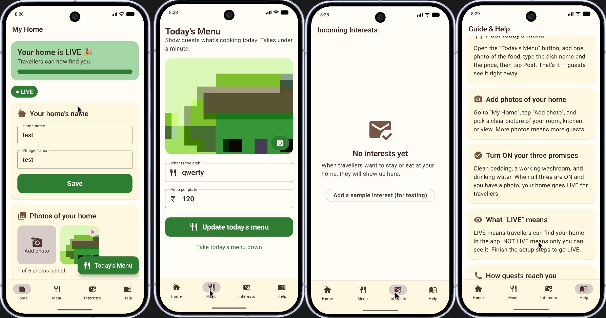

<div align="center">

# 🏡 Namma HomeStay

**A "Simplified Host Portal" that makes digital marketing as easy as making a phone call.**

Built for rural farmers and homemakers with low digital literacy — big buttons, high contrast, warm earth tones, and zero technical jargon.


[](https://github.com/ifsvivek/NammaHomeStay/releases/latest)
[](#installation)
[](#license)

<br/>



</div>

---

## Table of contents

1. [Problem statement](#problem-statement)
2. [Demo](#demo)
3. [Features](#features)
4. [Screenshots](#screenshots)
5. [Tech stack](#tech-stack)
6. [Folder structure](#folder-structure)
7. [Installation](#installation)
8. [Run](#run)
9. [Firestore data model](#firestore-data-model)
10. [Future improvements](#future-improvements)
11. [License](#license)

---

## Problem statement

Rural hosts — farmers, homemakers, families with a spare room — have everything a small homestay needs: a clean room, home-cooked food, a phone, and the will to host travellers. What they don't have is comfort with smartphones or English-heavy "tourism apps". Existing booking platforms assume comfortable digital literacy: email logins, passwords to remember, dense forms, technical settings, fine print.

**Namma HomeStay** removes every one of those barriers and reframes "running an online homestay" as a sequence of phone-call-simple actions:

- Sign in with just a **phone number and an SMS code** — no email, no password.
- Set up your "home" by tapping a few **large cards** (name, photo, three "promises").
- Post today's meal in under a minute with **one photo + a name + a price**.
- Talk to interested travellers by tapping a big **green "Call Guest"** button.

The design rule throughout is **"Less is More"**: large touch targets, high-contrast earth tones, body text at 18 sp, no technical jargon, and a clear ✓ confirmation after every save so the host knows "the internet did its job."

---

## Demo

The fastest way to see the app is to install the **signed release APK**:

➡ **[Download `NammaHomeStay-v1.0.0.apk` from Releases](https://github.com/ifsvivek/NammaHomeStay/releases/latest)** *(~17.8 MB, APK Signature Scheme v2)*

Allow "install from unknown sources" on the device once, then open the APK. The app is wired to a live Firebase project (`nammahomestay-dfe84230`).

### 🔑 Demo sign-in (use these — billing is not enabled, so real SMS is off)

Firebase **Phone Authentication** on the free Spark plan can't send real SMS, so a fixed test number is whitelisted in the Firebase console. Use it as-is — nothing will be sent to a real phone:

| Field | Value |
|---|---|
| Phone number | `9876543210` *(country code `+91` is pre-filled by the app)* |
| OTP code | `123456` |

Type the 10 digits, tap **Send code**, type the 6-digit code, tap **Verify & continue** — you're in. If you want to point the app at your own Firebase project instead, see [Installation](#installation) below.

---

## Features

### 📱 Frictionless onboarding
- One-screen sign-in: phone number → 6-digit SMS code. No passwords, no email.
- SMS auto-retrieval / instant verification when the device supports it.
- First sign-in lands you on a **"Setup your Home"** progress bar (X of 5 steps done).

### 🏠 My Home — the digital shopfront
- `LazyColumn` of large cards: setup progress, a clear **LIVE / NOT LIVE YET** pill, home name & village, a photo strip, and the "promises to your guests" toggles.
- **Verification checklist**: three big toggles — clean bedding · working washroom · drinking water. The home goes **LIVE** only when all three are on, there's at least one photo, and the home has a name. (See [`HomestayLogicTest`](app/src/test/java/com/ifsvivek/nammahomestay/data/model/HomestayLogicTest.kt) for the unit tests pinning this rule down.)
- **Photo upload**: "Tap to add photo" → pick from gallery/camera. Images are aggressively compressed for rural data; up to 6 photos.
- A floating **"Today's Menu"** button, always one tap away.

### 🍲 The "60-Second Menu" (the priority MVP feature)
- One photo + one dish name + one price + one big button — built to feel like posting a WhatsApp status.
- Publishing is a single Firestore `set()`, with a full-screen ✓ to confirm.
- Editing today's menu pre-fills the last one; "Take today's menu down" removes it.

### 📞 Inquiry Box & direct connect
- "Incoming Interests" lists travellers (name + relative time + status).
- Tap a card → expand → big **green "Call Guest"** button opens the phone dialer with the number pre-filled (`ACTION_DIAL` — no `CALL_PHONE` permission needed) and marks the inquiry as called.
- "Add a sample interest" button to seed test data until the traveller-facing app exists.

### 📖 Guide & Help
- Plain-language help cards for every feature, a "Call support" button, and sign out.

### Design & feedback (cross-cutting)
- **Earth-tone** Material 3 theme (leaf green / clay brown / harvest gold / cream); dynamic wallpaper colour is intentionally **off** so the brand stays consistent.
- Large typography (`headlineMedium` titles, ≥ 18 sp body), ≥ 48 dp touch targets, 60 dp primary buttons.
- Every action shows a `Snackbar` or success animation; errors surface the real exception message (handy while wiring up Firebase).
- Slim, low-chrome top headers and a 4-tab bottom navigation bar (Home · Menu · Interests · Help).

---

## Screenshots

<p align="center">
  
</p>

Left → right: **My Home** (setup progress, status pill, name + photos + promises) · **Today's Menu** (the 60-second post screen) · **Incoming Interests** (empty state with the dev seed button) · **Guide & Help** (plain-language cards).

---

## Tech stack

| Layer | Choice |
|---|---|
| Language | Kotlin 2.2 |
| UI | Jetpack Compose (Material 3, Compose BoM 2026.02) |
| Architecture | MVVM + a thin repository layer |
| Auth | Firebase Phone Auth (OTP) |
| Database | Cloud Firestore (real-time listeners, on-device offline cache) |
| Images | **Stored as compressed JPEG `Blob`s inside Firestore documents** — see note below. Coil renders the local pick-preview; a custom `PhotoImage` decodes stored blobs off the main thread. |
| Image picking | `ActivityResultContracts.GetContent` |
| Navigation | Navigation-Compose (4-tab bottom bar) |
| Build | Gradle (Kotlin DSL) + version catalog; AGP 9.2.1; minSdk 24 / targetSdk 36 |
| Tests | JUnit 4 unit tests on the domain logic ([`HomestayLogicTest`](app/src/test/java/com/ifsvivek/nammahomestay/data/model/HomestayLogicTest.kt)) |

### A note on photos & the free Firebase plan

The free Firebase **Spark** plan no longer includes Cloud Storage for new projects, so this app **does not use Cloud Storage at all**. Instead:

- `ImageCompressor` scales an image down (≤ ~1080 px) and then keeps lowering JPEG quality until the bytes fit a budget (≈ 140 KB for home photos, ≈ 350 KB for the dish photo).
- Those bytes are stored as a Firestore `Blob` directly on the document — well under Firestore's ~1 MB per-document limit.
- `Homestay.MAX_PHOTOS` therefore caps photos at **6**. (Want full-resolution or unlimited photos later? Upgrade to the Blaze plan and move blobs into Cloud Storage — only the repository layer changes.)

---

## Folder structure

```
NammaHomeStay/
├─ app/
│  ├─ build.gradle.kts             # app module: deps, signing config, build types
│  ├─ google-services.json         # Firebase config (committed for dev)
│  ├─ proguard-rules.pro
│  └─ src/
│     ├─ main/
│     │  ├─ AndroidManifest.xml
│     │  ├─ java/com/ifsvivek/nammahomestay/
│     │  │  ├─ NammaHomeStayApp.kt           # Application — Firebase init + Firestore offline cache
│     │  │  ├─ MainActivity.kt               # Auth gate: LoginScreen ↔ MainScreen
│     │  │  ├─ data/
│     │  │  │  ├─ model/Models.kt            # Host, Homestay, DailyMenu, Inquiry, VerificationChecklist
│     │  │  │  ├─ FirestoreCollections.kt
│     │  │  │  └─ repository/                # AuthRepository, HostRepository, MenuRepository, InquiryRepository
│     │  │  ├─ ui/
│     │  │  │  ├─ theme/                     # Earth-tone colours, large typography
│     │  │  │  ├─ components/Components.kt   # BigActionButton, SectionCard, PhotoImage, NammaTopBar, …
│     │  │  │  ├─ navigation/Destinations.kt
│     │  │  │  ├─ MainScreen.kt              # bottom-nav shell + NavHost
│     │  │  │  ├─ auth/                      # AuthViewModel, LoginScreen
│     │  │  │  ├─ home/                      # HomeViewModel, HomeProfileScreen
│     │  │  │  ├─ menu/                      # MenuViewModel, DailyMenuScreen   ← the priority MVP screen
│     │  │  │  ├─ inquiry/                   # InquiryViewModel, InquiryScreen
│     │  │  │  └─ guide/GuideScreen.kt
│     │  │  └─ util/                         # ImageCompressor, Dialer (ACTION_DIAL), ContextExt
│     │  └─ res/                             # Compose-friendly resources, launcher icons, themes.xml
│     └─ test/java/com/ifsvivek/nammahomestay/data/model/
│        └─ HomestayLogicTest.kt             # JUnit 4 tests on the canGoLive / isComplete rules
├─ gradle/
│  └─ libs.versions.toml                     # single source of truth for versions
├─ firestore.rules                           # host can only read/write their own docs
├─ firebase.json                             # `firebase deploy --only firestore:rules`
├─ .firebaserc
├─ keystore.properties.example               # template for the release signing config
├─ build.gradle.kts                          # project-level build script
├─ settings.gradle.kts
├─ gradlew / gradlew.bat                     # Gradle wrapper — `./gradlew assembleDebug`
├─ image.png                                 # the README screenshot grid
└─ README.md
```

---

## Installation

### Prerequisites

- **Android Studio** (latest stable) with the Android SDK
- **JDK 17+** (bundled with Android Studio)
- A **Firebase project** (free Spark plan works; see [Tech stack note](#a-note-on-photos--the-free-firebase-plan))

### 1. Clone

```bash
git clone https://github.com/ifsvivek/NammaHomeStay.git
cd NammaHomeStay
```

### 2. Open in Android Studio

Open the folder in Android Studio. It uses the Gradle version catalog ([`gradle/libs.versions.toml`](gradle/libs.versions.toml)) — just let it sync. No manual dependency setup needed.

### 3. Connect a Firebase project

- Create a Firebase project and an Android app with package name **`com.ifsvivek.nammahomestay`**.
- Download `google-services.json` into the [`app/`](app/) folder. *(A working one for the project `nammahomestay-dfe84230` is already committed so you can run the app immediately. Replace it to point at your own project.)*

### 4. Turn on the backend (in the Firebase console)

1. **Authentication → Sign-in method → Phone → Enable.** For development, also add a *test phone number* under "Phone numbers for testing" — e.g. `+91 9876543210` / `123456` — so you don't need real SMS or a SHA-1 on an emulator.
2. **Firestore Database → Create database** (pick a region, e.g. `asia-south1`).
3. Deploy the security rules with `firebase deploy --only firestore:rules` (the repo has [`firebase.json`](firebase.json) + [`.firebaserc`](.firebaserc)), or just start the database in **test mode** while developing.
4. *(For real phone numbers, later)* add your debug **SHA-1** under Project settings → Your apps, and re-download `google-services.json`.

> **No Cloud Storage setup is needed** — see [the photo storage note](#a-note-on-photos--the-free-firebase-plan).

### 5. (Optional) Set up release signing

The release build is signed automatically if a [`keystore.properties`](keystore.properties.example) file is present at the repo root. Copy the template and fill in your own keystore details:

```bash
cp keystore.properties.example keystore.properties
keytool -genkeypair -v -keystore app/release-keystore.jks \
  -alias namma -keyalg RSA -keysize 2048 -validity 10000
# then edit keystore.properties with the password and alias
```

`keystore.properties` and `*.jks` are gitignored.

---

## Run

### Run the debug build (most common)

```bash
./gradlew :app:installDebug      # build + install on a connected device/emulator
# or, just build the APK:
./gradlew :app:assembleDebug     # → app/build/outputs/apk/debug/app-debug.apk
```

### Run the unit tests

```bash
./gradlew :app:testDebugUnitTest
```

### Build the signed release APK

```bash
./gradlew :app:assembleRelease   # → app/build/outputs/apk/release/app-release.apk
```

> If a build ever fails with a stale `mergeDebugResources` / `merged.dir/values.xml` error, run `./gradlew clean` and rebuild — that's an incremental-cache glitch, not the code.

---

## Firestore data model

```
hosts/{uid}
  uid: string
  name: string
  phone: string
  verifiedStatus: "new" | "verified"     # flips to "verified" once the home is LIVE

homestays/{uid}                            # one shopfront per host; doc id == host uid
  hostId: string
  name: string
  location: string
  images: Blob[]                           # compressed JPEGs, max 6
  checklist: { cleanBedding, functionalWashroom, drinkingWater: bool }
  live: bool

daily_menus/{uid}                          # one doc per host; overwritten daily in a single set()
  hostId: string
  dishName: string
  price: number
  image: Blob | null
  dateTimestamp: timestamp

inquiries/{autoId}
  hostId: string
  guestName: string
  guestPhone: string
  status: "pending" | "called" | "closed"
  timestamp: timestamp
```

Security rules are in [`firestore.rules`](firestore.rules) — a host can only read/write their own `hosts` / `homestays` / `daily_menus`, and any signed-in user can create an `inquiry`.

---

## Future improvements

- **Traveller-facing app** — there is no browse/enquire app yet; right now the "Interests" tab is seeded via a dev test button. The roadmap is a second Compose app that reads LIVE homestays and writes to `inquiries`.
- **Cloud Storage for photos** — the current 6-photo cap and 350 KB-per-photo budget exist only because we're on the free Spark plan. On the Blaze plan we'd move blobs into Cloud Storage and remove both limits.
- **R8 / minification** — release build currently has `isMinifyEnabled = false` because the Firestore POJO models (Host / Homestay / DailyMenu / Inquiry) need explicit `-keep` rules before R8 obfuscation is safe. Adding those rules is a small, contained change.
- **More unit + UI tests** — only the LIVE-eligibility rules are unit-tested today. Compose UI tests for the four screens, and a Firestore-emulator integration test for the repositories, are obvious next steps.
- **Real support phone number** — `SUPPORT_PHONE` in [`GuideScreen.kt`](app/src/main/java/com/ifsvivek/nammahomestay/ui/guide/GuideScreen.kt) is a placeholder (`+911800000000`) — swap before shipping.
- **Localization (Kannada, Hindi, Tamil)** — strings are still English-only; the target audience would benefit from regional languages.
- **App Check / abuse hardening** — turn on Firebase App Check (Play Integrity provider) before opening sign-in to real numbers in production.

---

## License

Released under the **MIT License**. You're free to use, modify, and distribute this code; please keep the copyright notice. See the [GitHub repo](https://github.com/ifsvivek/NammaHomeStay) for the latest source.

---

<div align="center">
Made with care for hosts who'd rather make a phone call than fill out a form.
</div>
